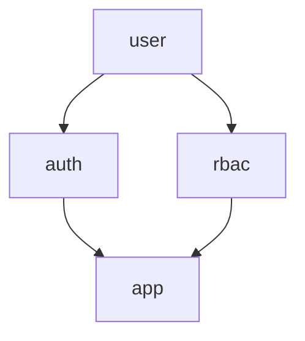

# webtyp/auth


Authentication mechanisms, sessions, identities, and OAuth providers for the
WebTyp ecosystem. Authorization belongs to `webtyp/rbac`. Both are siblings
that depend only on `webtyp/user` and never on each other.

> **BREAKING CHANGE**: `StateStore.CreateState` and `StateStore.ConsumeState` changed signatures to support browser-bound OAuth state nonces:
> - `CreateState(provider string) (state, nonce string, err error)`
> - `ConsumeState(state, nonce, provider string) error`
>
> Known consumers to update: `oauth2/oauth.go` (updated in this repo) and any custom implementations of `auth.StateStore`.



## Documentation

- [Architecture](docs/ARCHITECTURE.md) — Dependency rules, packages, local simulator

## Packages

- `auth` — Core ports: `SubjectStore`, `SessionIssuer`, `IdentityStore`,
  `StateStore`, `SecurityNotifier`, `SessionRepo`, `Config`, `ProfileDTO`,
  `ShellProfile`, OAuth types.
- `authority` — Concrete module (`Module`) implementing the ports, caches,
  migrations, and middleware. Configures a secure opaque cookie session strategy by default using 256-bit CSPRNG entropy (`webtyp/crypto/rand`) for session IDs and OAuth states.
- `oauth2` + `oauth2/provider/google`, `oauth2/provider/microsoft` — OAuth flow
  and providers.
- `session/cookie`, `session/jwt` — Session transports.
- `email_password`, `trusted_ip` — Credential authenticators.
- `local` — Development selector authenticator; no network, no env vars.

## Local Development

```go
scenarios := []local.Scenario{
    {ID: "user_admin", Name: "Alice", Email: "alice@example.com", Avatar: "", Roles: []string{"Administrator"}},
    {ID: "user_viewer", Name: "Bob", Email: "bob@example.com", Avatar: "", Roles: []string{"Viewer"}},
}
_ = authority.Migrate(db.RawConn(), db.RawConn().(ddl.Compiler))
authMod, _ := authority.New(db, auth.Config{IDs: ids})
rbacSvc, _ := rbac.New(db)
// seed subjects and assignments via rbac before mounting
for _, s := range scenarios { /* ensure user and AssignRole via rbacSvc */ }
localAuth := local.New(scenarios, authMod, authMod, local.WithAfterLogin("/"))
authMod.Enable(localAuth)
```

### LAN RUT Login Example

A LAN app identifies staff by RUT and checks the request's IP. Configure the
module first, then enable the mode — `Enable` registers on the module you built:

```go
authMod, _ := authority.New(db, auth.Config{
    IDs:     ids,
    IdleTTL: 1800, // 30 min without activity ends the session (sliding)
    Permissions: &auth.Permissions{
        Resolver:  rbacSvc, // satisfies auth.ActionResolver structurally
        ProjectID: "main",
        Resources: []model.Resource{"service_catalog"},
    },
})

// trustProxy is explicit, not an Option: behind a reverse proxy every request
// otherwise looks like it came from the proxy's own IP.
authMod.Enable(trustedip.New(authMod, trustedIPStore, authMod, authMod, false))
```

The client builds its single-field login form from `auth.RUTLoginDataModel` and
posts it to `auth.PathLoginRUT`. `trustedIPStore` is the consumer's
`auth.TrustedIPStore` — answer it per user, not per network, or anyone inside
the LAN can log in as anyone else.

Administering which RUT belongs to which user goes through the `register_lan`,
`unregister_lan` and `get_lan` operations, gated on `auth.ResourceLANIdentity`.
Grant that resource only to LAN administrators: registering a RUT mints a login
credential, which is a different privilege from editing user records.

> **Not yet supported: users without an email.** `CreateUser("", …)` writes an
> empty string, and a second one fails with `ErrEmailTaken` because the column
> is `Unique`. See `docs/PLAN.md` stage 4 — it is blocked on the
> `NULLABLE_COLUMNS` wave, not on this module.

Production builds use `oauth2.New` with a real `google.GoogleProvider` and never
register `local`.
