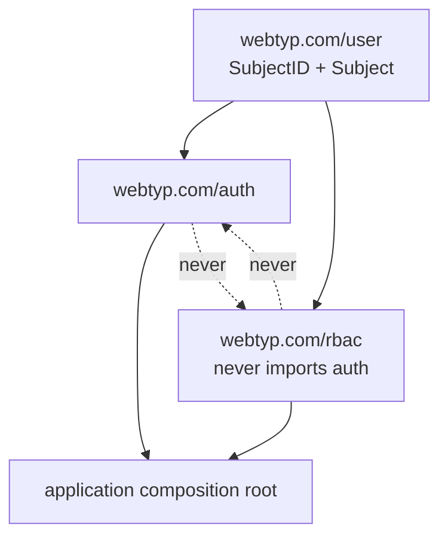
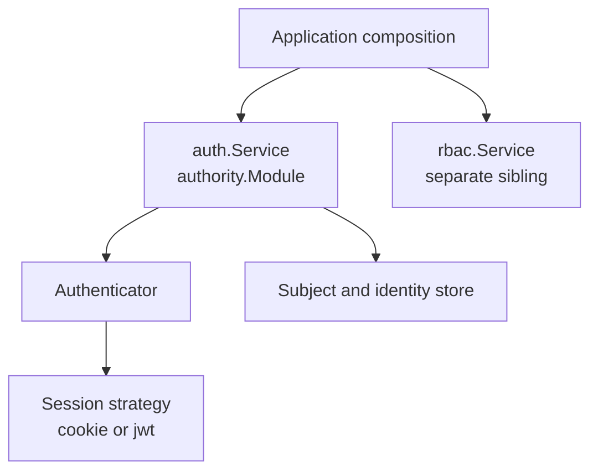
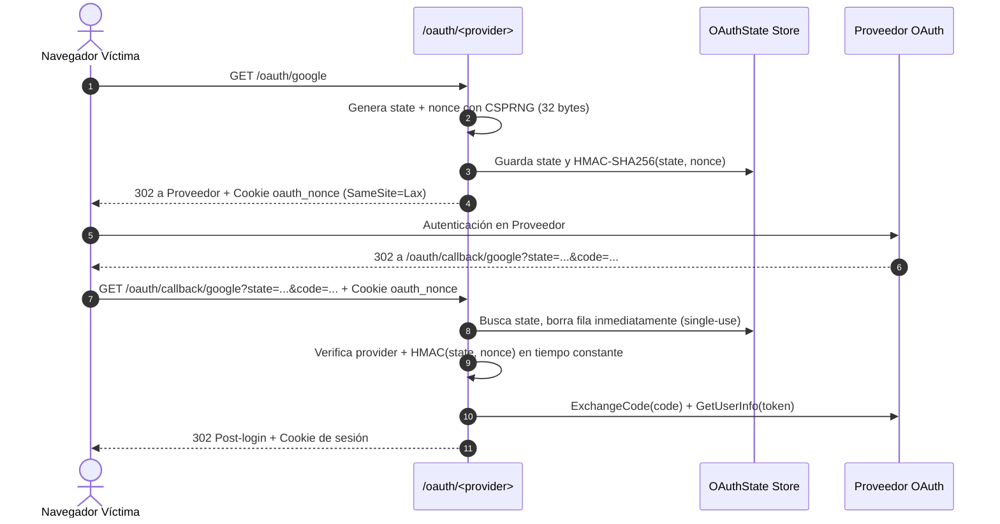

# Architecture

`webtyp/auth` owns authentication mechanisms: subjects and their external
identities, login flows, session lifecycle, OAuth state, and concrete providers.
It depends on `webtyp/user` only for the stable `Subject` value contract.

It never decides roles or permissions. Applications compose its authentication
middleware with `webtyp/rbac` explicitly. `auth` and `rbac` are siblings;
neither imports the other.

## Dependency Direction



Rules:

- `user` imports neither `auth` nor `rbac`.
- `auth` imports `user`; it may depend on `orm`, `fetch`, `jwt`, `sqlite`,
  `crypto`, and provider packages. It never imports `rbac`.
- `rbac` imports `user`; it may depend on its own persistence. It never imports
  `auth`.
- Only the composition root imports both.

## Packages

- `auth`: service, persistence, session middleware, and shared login ports
  (`SubjectStore`, `SessionIssuer`, `IdentityStore`, `StateStore`,
  `SecurityNotifier`, `SessionRepo`).
- `authority`: concrete `Module` implementing the ports; owns `user`, `session`,
  `identity`, `lanip`, `oauth_state` tables and the session cache. The session cache
  is strictly read-through (`GetSession` loads on miss) and is intentionally not
  pre-warmed on module construction to avoid costly table scans in short-lived isolate
  environments. Schema DDL is reconciled explicitly via `authority.Migrate` at deploy
  time; `New` assumes the schema already exists and performs no database queries.
- `oauth2`: OAuth authorization-code flow (begin/callback, state handling).
- `oauth2/provider/*`: concrete Google and Microsoft protocol adapters.
- `session/*`: concrete session transports (`cookie`, `jwt`).
- `email_password`: email+password credential authenticator.
- `trusted_ip`: RUT + IP allowlist authenticator.
- `local`: deterministic development login scenarios; it never contacts Google,
  never uses `fetch`, and has no environment variables.



## Local Simulator

`auth/local` receives an explicit slice of immutable `Scenario` values (stable
subject identifier, display name, email, avatar, display role labels), an
`auth.SubjectStore`, an `auth.SessionIssuer`, and an explicit `AfterLogin`
route. It exposes `ProviderName`, `PathStart`, and `PathSelect`. The GET route
serves a minimal selector; the POST route validates the identifier against the
configured slice, rejects unknown/empty with a deterministic 400, resolves or
creates the identity through `SubjectStore`, calls `SessionIssuer.IssueSession`,
and redirects to `AfterLogin`. It never assigns roles.

## Credenciales portadoras

Cualquier valor en el sistema que actúe como credencial portadora ( bearer credential ) debe ser completamente impredecible y generarse mediante el CSPRNG del ecosistema (`webtyp.com/crypto/rand`). No se utilizan generadores de identificadores correlativos o basados en tiempo (`ids`) para este tipo de valores.

| Campo / Valor | Origen de Aleatoriedad | Razón |
|---|---|---|
| `User.Id` | `ids` (`unixid`) | Clave primaria interna, no viaja como credencial. |
| `Identity.Id` | `ids` (`unixid`) | Clave primaria interna de relación con proveedor. |
| `LANIP.Id` | `ids` (`unixid`) | Clave primaria interna de IP permitida. |
| `Session.Id` | `rand` (`SecretN(32)`) | Credencial portadora enviada en la cookie de sesión. |
| `OAuthState.State` | `rand` (`SecretN(32)`) | Token anti-CSRF enviado al proveedor OAuth. |
| OAuth Nonce | `rand` (`SecretN(32)`) | Token ligado al navegador enviado en cookie `oauth_nonce`. |

## El intercambio OAuth

Para prevenir ataques de login-CSRF (donde un atacante fuerza a una víctima a consumir el `code` del propio atacante), el parámetro `state` enviado al proveedor de identidad se vincula de forma estricta al navegador que inició la sesión mediante un `nonce` en cookie.



## Security Events

All modes report `SecurityEvent` on `TopicSecurity = "auth.security"` via the
optional `events.Publisher` injected in `auth.Config`. `nil` drops events.
New event types:
- `EventInvalidRUT`: `trusted_ip` rejected a login attempt because the RUT failed checksum validation.
- `EventUnknownRUT`: `trusted_ip` rejected a login attempt because no identity or user was found for a valid RUT.

## In-Library `opMe` Composition & ProfileDTO

`opMe` composes identity with authorization in-library when `Config.Permissions` is provided:
```go
authMod, _ := authority.New(db, auth.Config{
    IDs: ids,
    Permissions: &auth.Permissions{
        Resolver:  rbacSvc, // satisfies ActionResolver structurally
        ProjectID: "main",
        Resources: []model.Resource{"service_catalog", "staff"},
    },
})
```
`ProfileDTO` provides `Grant(resource, actions)` to produce wire permissions ("resource:actions") and `Allows(resource)` to evaluate access on the client.

## Sliding Idle Sessions

`Config.IdleTTL` configures sliding session expiry. When `IdleTTL > 0`, every authenticated `GetSession` extends `ExpiresAt` to `now + IdleTTL` if the new expiry exceeds the current one. `IdleTTL = 0` (default) preserves fixed `TokenTTL` expiry.

## LAN Identity Administration Operations

`authority` exports three MCP operations for LAN RUT identity administration:
- `OpRegisterLAN` (`register_lan`): links a normalized RUT to a user ID.
- `OpUnregisterLAN` (`unregister_lan`): removes a user's LAN identity and associated allowed IPs.
- `OpGetLAN` (`get_lan`): retrieves a user's registered RUT identity.
